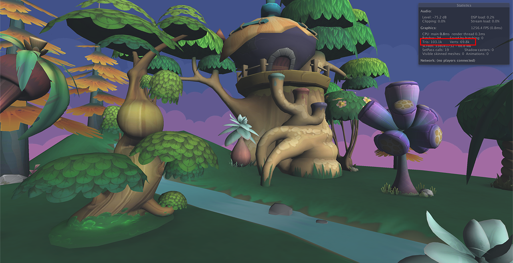
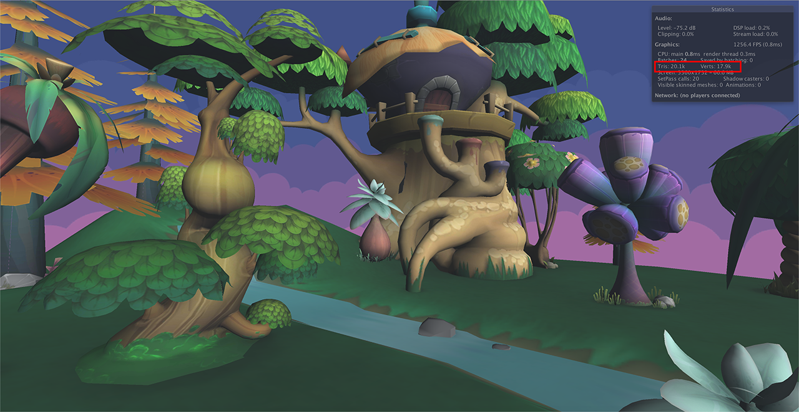
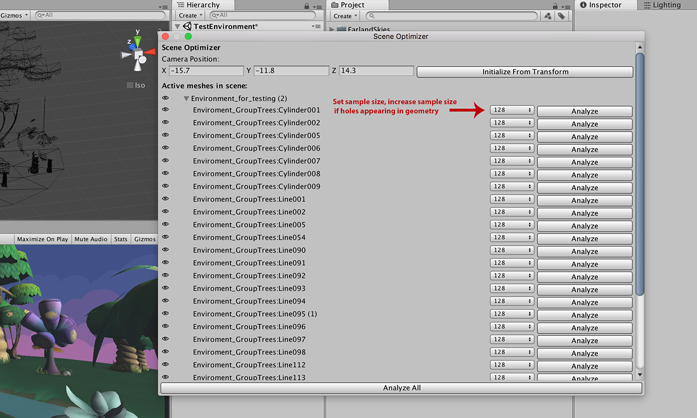
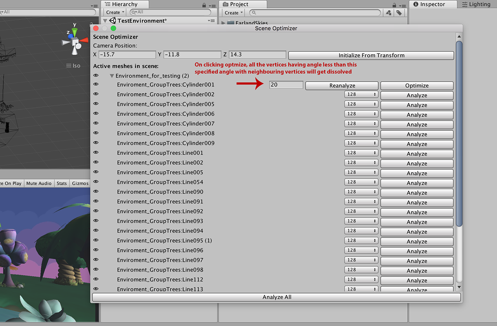

# UnityVR-Mesh-Optimizer
Reduce geometry of meshes, optimised for 3DOF VR experience.

# Results:
Before: 103.1k Triangles and 69.8k vertices

After: 20.1k Triangles and 17.9k vertices

# To Use:
1. Open Project in Unity and open your desired scene with geometry to optimize.
2. In menubar, goto "IDS->Optimize Scene for 3DOF".
3. In the Editor window that opens, Enter player position or drag the player transform.
4. Select the sample size and click Analyze button and wait. This step can take time. If holes appear in some mesh, increase the sample size for that mesh.

5. After the analyzation is complete, enter the threshold angle to dissolve all the vertices with angle less than that with neighbouring vertices.

5. Click Generate.

Process: 
1. First, it does back culling and remove all triangles which will not be visible to user.
2. Then, it uses a threshhold angle value to simplify geometry while maintaining the same silhouette.

# -- Work in Progress--
3. Output the obj files generated, with option to combine all meshes into one as well as with sharing the same material so as to reduce batch count.
4. Allow for limited 6DOF
